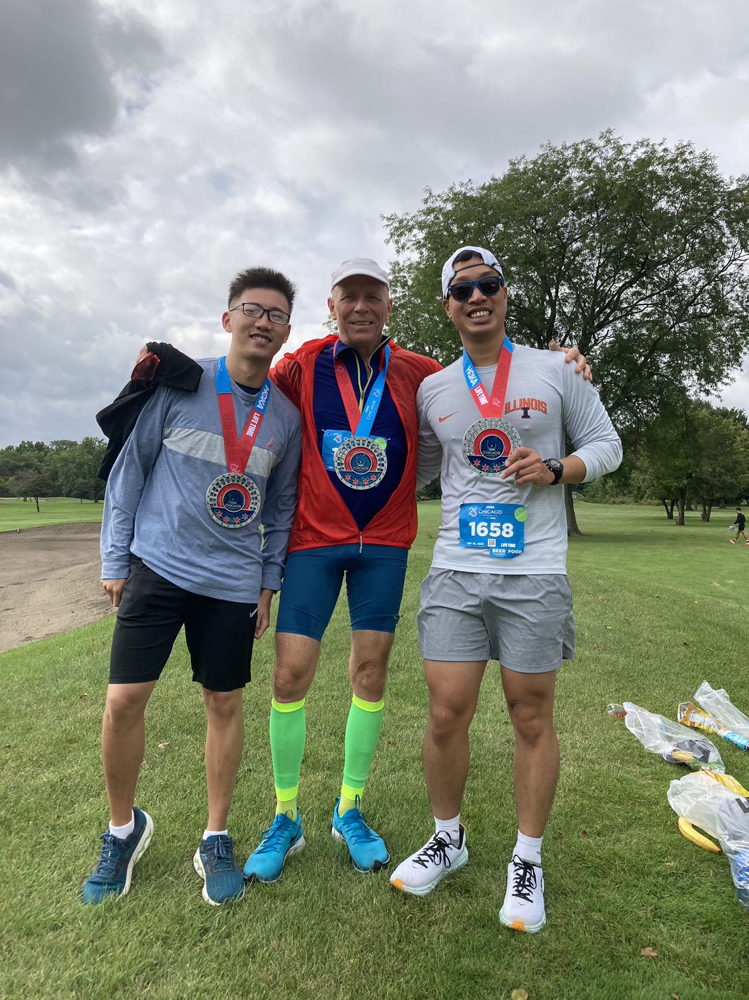
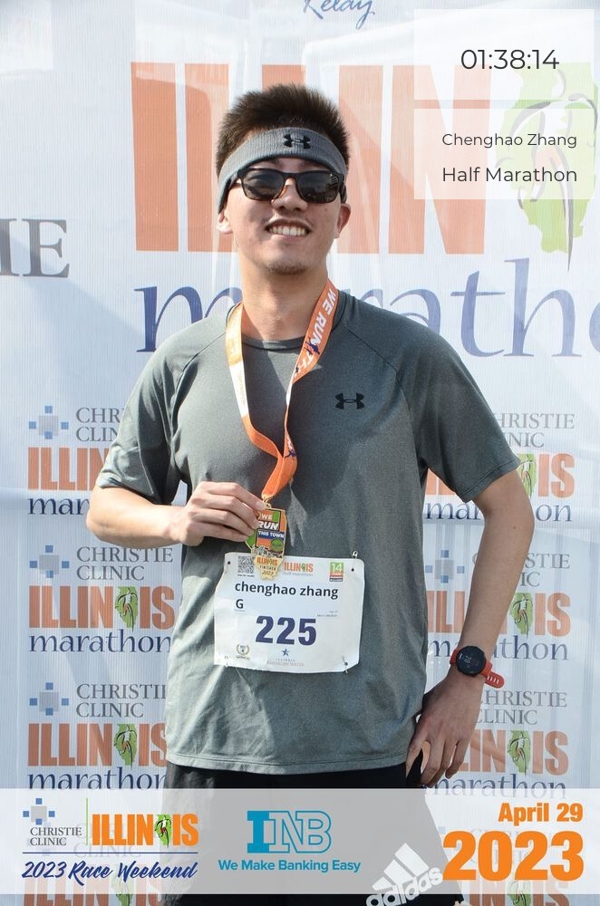
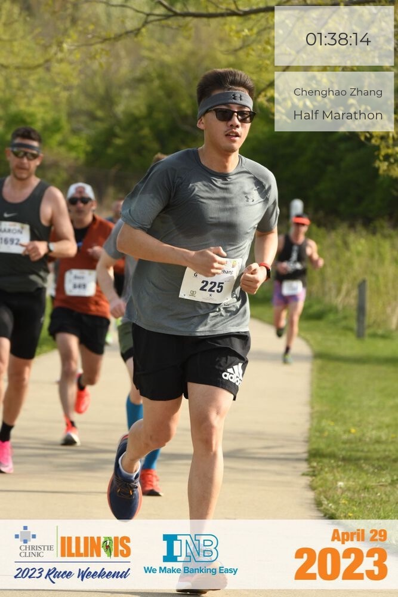
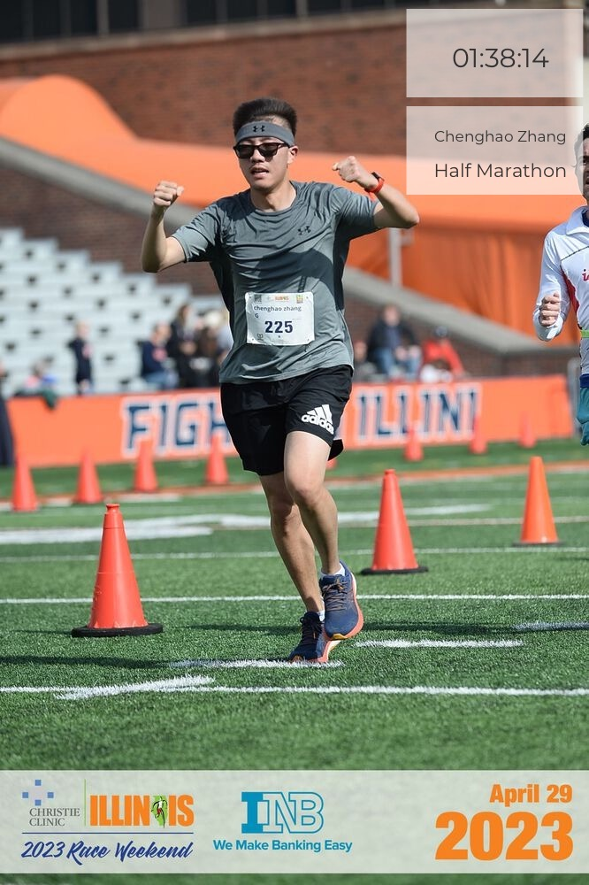

Outside research, I am an avid runner. You can see my race result on [Athlinks](https://www.athlinks.com/athletes/494795677).

Below are also some race event photos with friends.

**Chicago Hoka Half Marathon 2022** 

It turns out the race organizer mess up the distance. The race is only 12.6 miles instead of 13.2 miles. However, I will still count this as my first half marathon event.

My initial expectation is 2:10:00, however, my final result is 1:48:48 (should be 1:50:00 + if it's a half marathon). It's quite impressive to me and my friends that I can run into 2:00:00 for my half marathon!

This race introduces me to the running and more importantly, helps me make many good friends. Special thanks to Arash, who is an experienced runner and my labmate. I learned a lot from him.

I didn't have many images left for the race, but below is a nice one:

**Illinois Race Weekend Half marathon 2023**

This is my second marathon. After training hard for 4 months (thanks to the morning run I did with Arash at [Crystal Lake Park](https://www.google.com/maps/place/Crystal+Lake+Park/@40.1230726,-88.2115754,17z/data=!3m1!4b1!4m6!3m5!1s0x880cd779f38e23c7:0xaa05747e26c14d67!8m2!3d40.1230726!4d-88.2090005!16s%2Fg%2F1hc33f862?entry=ttu) in numerous mornings),
I successfully run into 1:40:00! It's a memorable event. You can find my cool images below. Also special thanks to the Loomis Running club. I also want to thank Michael and Susie who cheered for me during the race.

