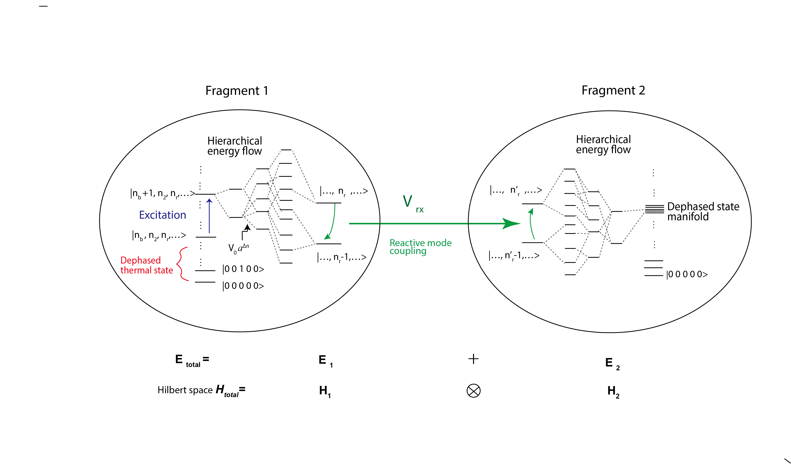
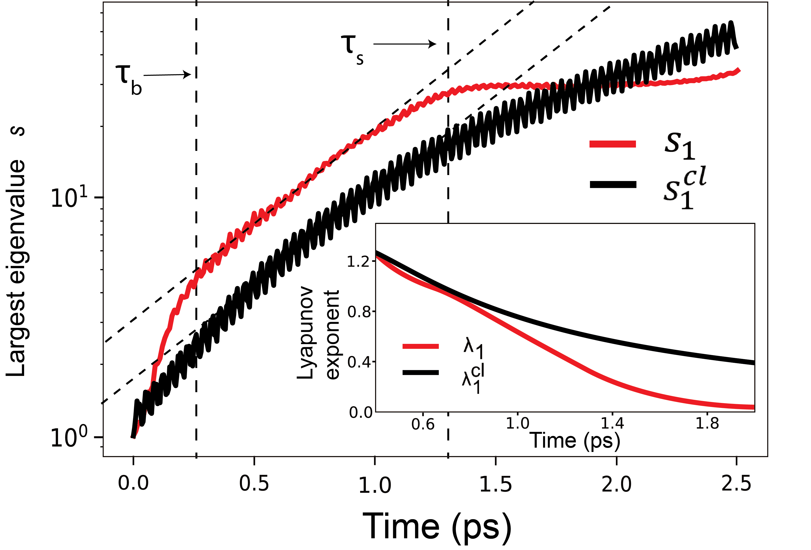
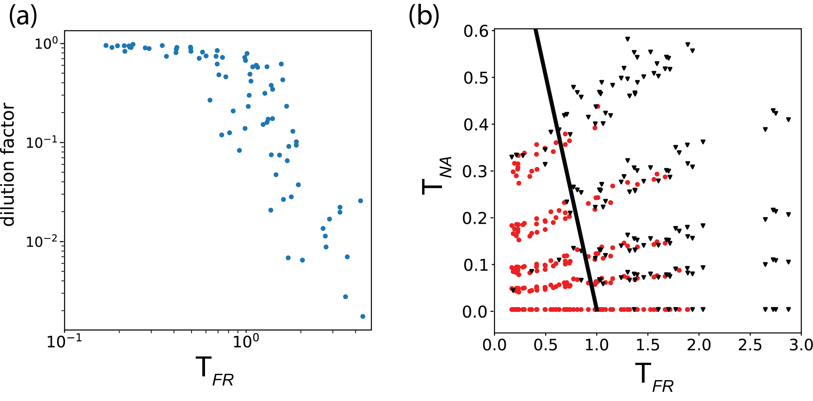

Hi! I am Chenghao Zhang, I am currently a Ph.D. student at Department of Physics, University of Illinois at Urbana Champaign (UIUC), advised by Prof. [Martin Gruebele](https://gruebele-group.chemistry.illinois.edu/). I also benefit from collaboration with Prof. [Peter Wolynes](https://wolynes.rice.edu/) at Rice University.

As a physicist by training, I got my physics undergraduate degree from Peking University, Beijing, China. In my undergraduate study, I worked on nonequilibrium statistical physics and biophysics with Prof. [Yuhai Tu](https://researcher.watson.ibm.com/researcher/view.php?person=us-yuhai) and Prof. [Qi Ouyang](http://www.cls.edu.cn/english/PrincipalInvestigator/pi/index1642.shtml). Now I am working at the interface of chemistry and physics. I am interested at studying intramolecular vibrational energy redistribution, quantum scrambling and quantum localization in complex chemical systems, and chemical dynamics in nonadiabatic systems and in condensed phase systems.

**Projects**
======
Some of projects I have worked on:

 - **Energy flow limited reactivity** ( with [Martin Gruebele](https://gruebele-group.chemistry.illinois.edu/) and [Edwin Sibert](https://sibert.chem.wisc.edu/) , [JCP2021](https://aip.scitation.org/doi/10.1063/5.0043665) ) 
    
  - **Quantum information scrambling in Molecules** (with [Martin Gruebele](https://gruebele-group.chemistry.illinois.edu/) and [Peter Wolynes](https://wolynes.rice.edu/) , [PRA2022](https://journals.aps.org/pra/abstract/10.1103/PhysRevA.105.033322))
    
  
  - **Surface crossing and energy flow in many-dimensional quantum systems** (with [Martin Gruebele](https://gruebele-group.chemistry.illinois.edu/) , [David E Logan](https://www.chem.ox.ac.uk/people/david-logan) and [Peter Wolynes](https://wolynes.rice.edu/) , [PNAS2023](https://www.pnas.org/doi/abs/10.1073/pnas.2221690120) ) [News](https://news.rice.edu/news/2023/theory-can-sort-order-chaos-complex-quantum-systems)
  

**CV**
======
You can find my CV [here](https://phyzch.github.io/cv/) 
